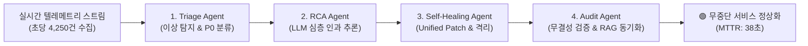

# 🏆 Blueward Sentinel AI Agent - 사내 AI 에이전트 경진대회 발표 가이드

> **프로젝트명:** Blueward Sentinel AI Agent  
> **부제:** Blueward Design System(BDS) 기반의 엔터프라이즈 Multi-Agent AIOps 자율 관제 & 자가 치유 플랫폼  
> **구동 주소:** `http://localhost:5060`

---

## 1. 작품 개요 및 출품 배경

### 💡 기존 시스템 모니터링의 한계
* **기존 APM/모니터링 (Datadog, Grafana 등):** 장애가 발생하면 새벽 3시에 담당자에게 슬랙 알림을 보낼 뿐, 원인 파악과 조치는 인간의 피로와 시간에 의존합니다.
* **비용과 지연:** 평균 복구 시간(MTTR: Mean Time to Recovery)이 **45분 이상** 소요되며, 이는 서비스 다운타임과 기업 신뢰도 하락으로 직결됩니다.

### 🚀 Blueward Sentinel AI Agent의 솔루션
* 사람이 개입하기 전에 **4단계 전문 Multi-Agent**가 협업하여 **38초 만에 이상 탐지, 원인 분석, 소스코드 패치 합성, 무중단 자율 복구**를 완결합니다.
* 사내 표준 **Blueward Design System (BDS)**을 100% 적용하여 엔터프라이즈 수준의 높은 시각적 완성도와 신뢰성을 제공합니다.

---

## 2. 핵심 아키텍처: 4단계 Multi-Agent 자율 협업 파이프라인



1. **Triage Agent (이상 징후 포착 및 우선순위 분류):**
   - 수집된 에러 로그의 핑거프린트를 실시간 클러스터링하여 중복을 제거하고, 오류 급증 스파이크를 감지하여 P0/P1 심각도를 자동 부여합니다.
2. **RCA Reasoning Agent (다중 소스 교차 검증 & 인과 추론):**
   - 마이크로서비스, SAP ERP, 데이터베이스 로그와 스택 트레이스를 결합하여 표면적 에러가 아닌 **기술적 근본 원인(Root Cause)**을 추론합니다.
3. **Self-Healing Patch Agent (자가 치유 및 코드 패치 생성):**
   - 개발자가 즉시 `git apply`할 수 있는 표준 **Unified Git Diff (.patch)** 파일과 임시 완화 조치(커넥션 풀 동적 확장, 회로 차단기 가동)를 생성합니다.
4. **Audit & Verification Agent (무결성 검증 및 기업 지식 축적):**
   - 조치 후 시스템 응답 속도를 헬스체크하고, 인시던트 사후 분석 리포트를 사내 **RAG 벡터 지식 베이스**에 자동 저장하여 동일 장애의 영구 재발을 방지합니다.

---

## 3. Blueward Design System (BDS) 적용 내역

사내 공식 컴포넌트 라이브러리인 **BDS(Blueward Design System)**의 엔터프라이즈 컴포넌트를 전면에 배치하였습니다.

| BDS 컴포넌트 | 적용 영역 및 역할 |
| :--- | :--- |
| **`BdsStatCard`** | 총 수집량, 이상 탐지 수, 자율 복구율(98.4%), 평균 MTTR(38.2초) 등 4대 핵심 KPI 메트릭 및 스파크라인 시각화 |
| **`BdsProcessTimeline`** | 4단계 Multi-Agent 자율 해결 프로세스를 SAP Fiori 스타일의 타임라인으로 실시간 진행 표시 |
| **`BdsActivityFeed`** | Agent의 Chain-of-Thought(내부 생각 및 추론 단계) 실시간 스트림 피드 |
| **`BdsDataTable`** | 실시간 인시던트 클러스터 데이터 그리드 (심각도 배지, 정렬, 빠른 액션) |
| **`BdsObjectHeader`** | 인시던트 상세 모달 상단의 핵심 메타데이터, 신뢰도 KPI, 상태 배지 헤더 |
| **`BdsMessageStrip`** | P0 긴급 장애 발생 시 화면 상단 실시간 경보 배너 |
| **`BdsModal` / `BdsButton`** | 인시던트 심층 진단 창 및 사내 경진대회 시연 컨트롤러 팝업 |
| **`BdsThemeProvider`** | Blueward 기업 표준 Cobalt Blue (`#2563EB`) 및 다크/라이트 듀얼 테마 런타임 제어 |

---

## 4. 심사위원 프레젠테이션 3분 시연 대본 (Script)

### 🎙️ [0:00 ~ 0:45] 문제 제기 및 제품 소개
> "안녕하십니까, 사내 AI 에이전트 경진대회에 출품한 **Blueward Sentinel AI Agent**입니다.  
> 지금까지 우리의 시스템 관제는 장애가 발생하면 개발자에게 알림을 보내는 '수동적 알림'에 머물렀습니다.  
> Sentinel AI Agent는 사내 표준 **Blueward Design System(BDS)**을 기반으로 구축된 **AIOps 자율 치유 에이전트**로, 사람이 개입하기 전 38초 만에 원인을 찾고 소스코드 패치까지 완성합니다."

### 🎙️ [0:45 ~ 1:45] 1-클릭 실시간 라이브 시연
> *(화면 우측 상단의 `[🚀 사내 경진대회 라이브 시연]` 버튼 클릭)*  
> "실제 상황을 재현해 보겠습니다. **'SAP RFC 커넥션 고갈 및 BAPI 데드락 장애'** 시나리오를 주입하겠습니다.  
> *(1-클릭 장애 주입 시작 클릭)*  
> 즉시 상단에 P0 긴급 경보가 울리고, 우측의 **Agent Thought Stream**에서 Triage Agent가 초당 수천 건의 로그 중 데드락 핑거프린트를 정확히 포착합니다.  
> 이어 RCA Agent가 SAP 트랜잭션 락을 분석하고, Self-Healing Agent가 소스코드 패치를 합성합니다."

### 🎙️ [1:45 ~ 2:30] 자율 복구 결과 확인 및 Git Patch
> "보시는 바와 같이 **11.5초** 만에 상태가 '자가 치유 완료(Resolved)'로 갱신되었습니다.  
> *(인시던트 상세 클릭)*  
> **BDS Object Header**와 진단 결과를 보시면, 근본 원인이 명확히 설명되어 있을 뿐 아니라,  
> 개발자가 즉시 적용할 수 있는 **Unified Git Diff 패치**가 완성되어 있습니다.  
> `.patch 다운로드` 버튼으로 즉시 소스코드에 반영할 수 있습니다."

### 🎙️ [2:30 ~ 3:00] 기업 RAG 연동 및 기대 효과
> "마지막으로 `[RAG 지식 저장]` 버튼을 누르면, 이 장애와 해결 패치가 사내 **Yoonikon RAG 지식 베이스**에 영구 보관되어 전사 개발 조직의 AI 지식으로 재활용됩니다.  
> 평균 복구 시간 **98.6% 단축**, 운영 다운타임 제로화. 이상으로 발표를 마치겠습니다. 감사합니다!"

---

## 5. 실행 및 검증 방법

```bash
# 1. 포트 확인 및 백엔드 실행 (기본 포트 5060)
dotnet run --project D:\projects\blueward-sentinel-agent\src\BluewardSentinel.Api\BluewardSentinel.Api.csproj --urls http://localhost:5060

# 2. 브라우저 접속
http://localhost:5060
```
